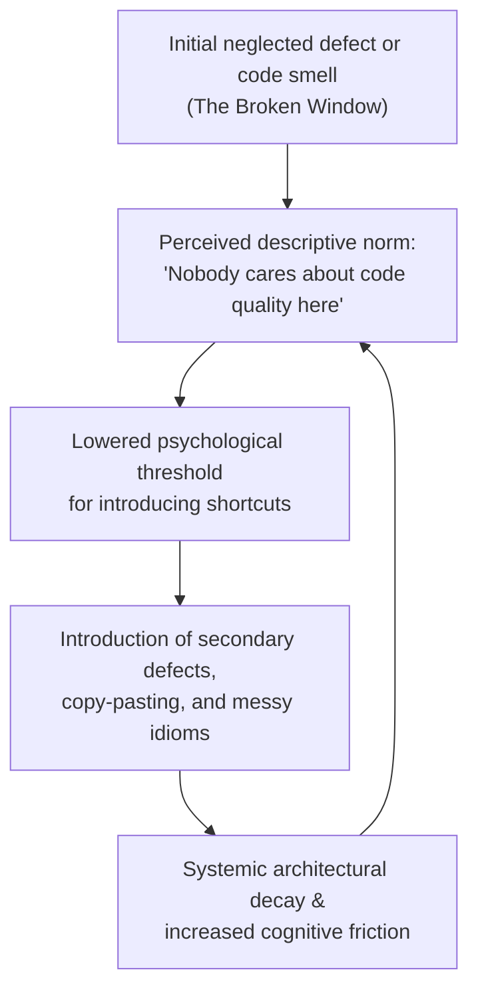
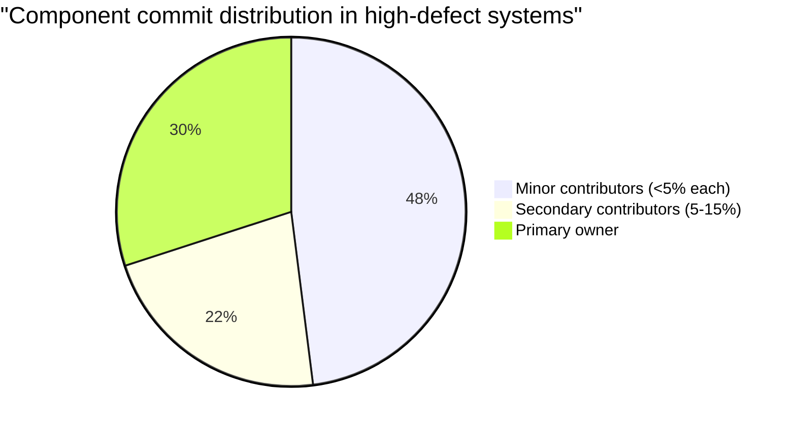
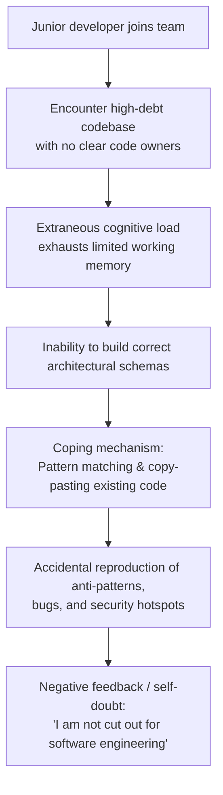
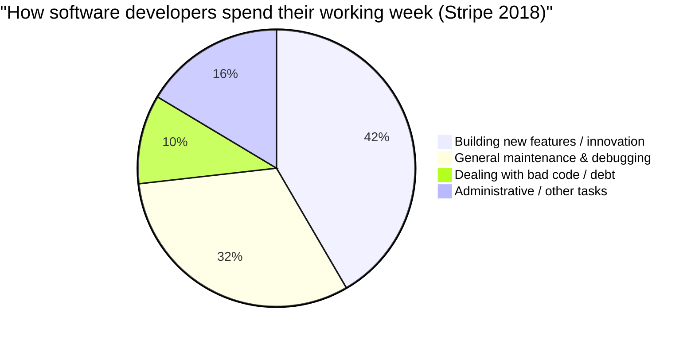
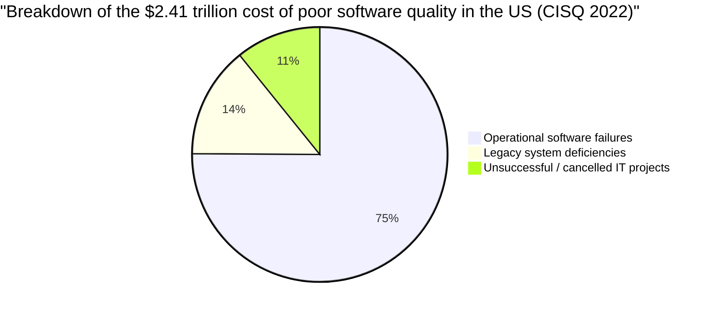
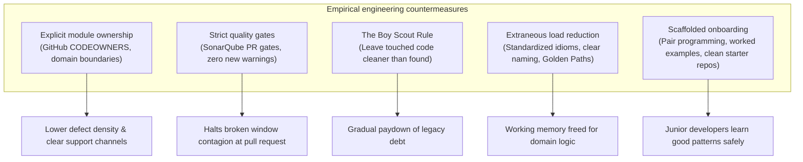

# Broken windows, technical debt, and developer wellbeing: an empirical research report

## Executive summary

Software engineering literature and management discourse frequently discuss technical debt, code quality, and engineering culture. However, conversations often rely on intuition or anecdotal experiences. Over the past two decades, empirical software engineering research has produced rigorous quantitative and qualitative evidence demonstrating that:

1. **The broken window theory is empirically validated in source code:** Developers working in codebases with high technical debt density are significantly and causally more likely to introduce new code smells, poor naming, and redundant implementations than those working in clean systems.
2. **Weak code ownership directly elevates defect density:** Components with fragmented ownership, high numbers of minor contributors (<5% commit share), and low specialized experience suffer statistically higher post-release failures than components with clear primary owners.
3. **Bad code is a primary external driver of developer unhappiness and burnout:** Working with poor code, cryptic architectures, and unmaintained systems leads to cognitive exhaustion, feelings of inadequacy, work withdrawal, and reduced problem-solving efficiency.
4. **Junior developers suffer disproportionately:** Because novices lack the extensive mental schema repositories of senior engineers, high extraneous cognitive load (imposed by code smells and confusing naming) leaves no working memory for learning (germane load). Consequently, junior engineers rely on pattern matching and mimic whatever low-quality patterns already exist in the repository.
5. **The economic and operational toll is staggering:** Industry studies show software engineers spend an average of 17.3 hours per week (~42% of their working time) on maintenance, debugging, and dealing with technical debt, with 4 hours lost strictly to "bad code." In the United States alone, the Consortium for Information & Software Quality (CISQ) estimated the cost of poor software quality at $2.41 trillion in 2022, with accumulated technical debt representing $1.52 trillion in modernization obstacles.

---

## Broken window theory and code decay: empirical foundations

### The Pragmatic Programmer and the broken window metaphor

The "broken window theory" was originally introduced in criminology by social scientists James Q. Wilson and George L. Kelling (1982, *The Atlantic Monthly*). They argued that visible signs of disorder and neglect (e.g., an unrepaired broken window in an abandoned building) signal a lack of oversight, rapidly inviting further vandalism, neglect, and crime.

In 1999, Andrew Hunt and David Thomas adapted this sociological metaphor to software engineering in their seminal book *The Pragmatic Programmer: From Journeyman to Master* (Addison-Wesley):

> *"One broken window, left unrepaired for any substantial length of time, instills a sense of abandonment—a sense that the inhabitants don’t care about the building. So another window gets broken. People start littering. Graffiti appears. Serious structural damage begins. In a relatively short span of time, the building becomes damaged beyond the owner’s desire to fix it, and the sense of abandonment becomes reality."*
> — Hunt & Thomas (1999, Chapter 1: "A Pragmatic Philosophy")

Hunt and Thomas posited that in software development, a "broken window" can take many forms:
- An unhandled exception or ignored edge case.
- Poorly formatted, commented-out, or dead code.
- Failing automated test suites left unaddressed.
- Bad variable names and architectural shortcuts.

The authors introduced the "Don't Live with Broken Windows" maxim, arguing that neglected code signals to the team that quality standards no longer apply, creating a psychological cascade where developers lose pride in the system and stop caring about clean design.

### Empirical validation: the Chalmers University study (Levén et al.)

For years, the broken window theory remained an intuitive hypothesis in the software industry. In 2022–2024, researchers William Levén, Hampus Broman, Terese Besker, and Richard Torkar from Chalmers University of Technology and the University of Gothenburg conducted a formal, controlled empirical experiment to test whether the theory holds true in practice.

- **Study:** Levén, W., Broman, H., Besker, T., & Torkar, R. (2024). *"The Broken Windows Theory Applies to Technical Debt."* *Empirical Software Engineering*, 29(4), 84. (Preprint: arXiv:2205.02100).
- **Methodology:** 
  - 29 software developers with varying industry experience were divided into two experimental groups.
  - Both groups were assigned identical programming feature tasks on a Java application.
  - Group A worked on a clean version of the codebase (low technical debt density, high structural hygiene).
  - Group B worked on a "decayed" version of the codebase containing deliberately introduced technical debt (pre-existing code smells, poor naming conventions, duplicate code, and lack of separation of concerns).
- **Key findings:**
  1. **Statistically significant causal relationship:** Developers working on the codebase with high technical debt were significantly more likely to introduce *new* technical debt ($p < 0.05$).
  2. **Re-implementation vs. reuse:** In the high-debt codebase, developers frequently chose to re-implement existing utility functions from scratch rather than reading, understanding, and reusing existing components due to low trust and poor discoverability.
  3. **Lexical decay:** Developers working in the degraded environment picked non-descriptive, generic variable and method names, conforming to the surrounding low-standard naming conventions.
  4. **Automated code smells:** Static analysis (SonarQube) revealed a higher incidence of newly introduced code smells in code produced by the group working on the high-debt codebase.
  5. **Conscious vs. unconscious introduction:** Post-experiment interviews revealed that developers were often aware they were taking shortcuts, citing the ambient state of the codebase as justification: *"The code was already messy, so spending time cleaning it up felt pointless."*

### Code smell contagion and behavioral mimicry

Subsequent empirical studies on software repository evolution (MSR) demonstrate that code smells are contagious:

- **Smell agglomeration and co-occurrence:** Palomba et al. (2018, *IEEE Transactions on Software Engineering*) and Tufano et al. (2017, *Journal of Systems and Software*) analyzed how code smells evolve over time in open-source systems. They found that once a class or module exhibits one significant smell (such as a `God Class` or `Long Method`), the probability of adjacent smells (such as `Feature Envy`, `Data Clump`, or `Shotgun Surgery`) appearing in the same module increases exponentially.
- **Descriptive norms vs. injunctive norms:** In behavioral psychology (Cialdini et al.), *injunctive norms* represent what people *ought* to do (e.g., coding standards written in a team wiki), whereas *descriptive norms* represent what people *actually* do (what the codebase currently looks like). When there is a conflict between written guidelines and the physical code, developers almost exclusively follow the descriptive norm of the existing codebase.

---

## Code ownership vs the tragedy of the commons

Code ownership describes the degree to which individual developers or dedicated teams have responsibility, authority, and specialized expertise over specific files, modules, or sub-systems.

### Microsoft Research: "Don't Touch My Code!" (Bird et al.)

In 2011, Christian Bird, Nachiappan Nagappan, Brendan Murphy, Harald Gall, and Premkumar Devanbu published one of the most influential empirical studies on software quality, which received the **ACM SIGSOFT Test of Time Award** in 2021.

- **Study:** Bird, C., Nagappan, N., Murphy, B., Gall, H., & Devanbu, P. (2011). *"Don't Touch My Code! Examining the Effects of Ownership on Software Quality."* In *Proceedings of the 19th ACM SIGSOFT Symposium and the 13th European Conference on Foundations of Software Engineering (ESEC/FSE '11)*, pp. 4–14. [DOI: 10.1145/2025113.2025119](https://doi.org/10.1145/2025113.2025119).
- **Dataset:** Analyzed two massive commercial operating systems: Windows Vista and Windows 7, examining millions of lines of code and hundreds of thousands of changes across thousands of components.
- **Ownership metrics:**
  - **Owner / Primary Owner:** The developer responsible for the largest proportion of commits to a component.
  - **Major Contributor:** A developer who contributed at least $5\%$ of the total commits to the component.
  - **Minor Contributor:** A developer who contributed less than $5\%$ of the total commits.
  - **Ownership Ratio:** The proportion of total commits made by the primary owner.

- **Key findings:**
  1. **Minor contributors drive defect rates:** Components touched by a high number of minor contributors had significantly higher pre-release fault counts and post-release failures. Minor contributors lack the architectural context to anticipate unintended side effects.
  2. **High ownership correlates with high quality:** Components with high ownership (where a primary owner or a small group of major contributors performed $\ge 75\%$ of changes) exhibited drastically lower defect densities.
  3. **Predictive superiority:** Adding ownership metrics to traditional defect prediction models (which only looked at code complexity, churn, and size) increased the accuracy and precision of identifying defect-prone binaries by over $10\%$. When low-expertise contributions were removed from models, predictive capability dropped substantially, confirming that non-owner edits are a prime signal of failure.

### Socio-technical alignment and organizational complexity (Nagappan et al.)

Three years prior to the ownership study, Nagappan, Murphy, and Basili conducted a landmark empirical study linking organizational structure directly to code defects.

- **Study:** Nagappan, N., Murphy, B., & Basili, V. (2008). *"The Influence of Organizational Structure on Software Quality: An Empirical Case Study."* In *Proceedings of the 30th International Conference on Software Engineering (ICSE '08)*, pp. 521–530. [DOI: 10.1145/1368088.1368160](https://doi.org/10.1145/1368088.1368160).
- **Core findings:**
  - Organizational complexity metrics (number of distinct teams editing a binary, organizational distance between contributors, team churn) predicted software defects with **$86.2\%$ precision and $84.0\%$ recall**.
  - Organizational metrics were significantly more accurate at predicting failure-prone components than code-level complexity metrics (such as cyclomatic complexity, code coverage, dependencies, or lines of code churn).
  - Code edited by geographically or organizationally dispersed teams without clear architectural boundaries suffered from the highest failure rates, providing quantitative proof for Conway's Law.

### Fine-grained authorship and specialized experience (Rahman & Devanbu)

In 2011, Foyzur Rahman and Premkumar Devanbu explored the distinction between general programming experience and file-specific experience.

- **Study:** Rahman, F., & Devanbu, P. (2011). *"Ownership, Experience and Defects: A Fine-Grained Study of Authorship."* In *Proceedings of the 33rd International Conference on Software Engineering (ICSE '11)*, pp. 491–500. [DOI: 10.1145/1985793.1985860](https://doi.org/10.1145/1985793.1985860).
- **Core findings:**
  - **Specialized experience vs. general experience:** A developer's specialized experience with a specific file or module is a much stronger predictor of defect reduction than their overall years of software engineering experience or total commits to the project at large.
  - A senior engineer editing a module they do not own or understand is almost as likely to introduce a bug as a less experienced engineer unfamiliar with that module.
  - Single-author code had lower implicated defect rates than multi-author code where responsibility was diffused.

### Collective ownership vs. unowned code: the tragedy of the commons

Extreme Programming (XP) popularized the term "Collective Code Ownership," where any team member is encouraged to improve any piece of code at any time. However, empirical research reveals a critical distinction between:

1. **Disciplined collective ownership:** A co-located or closely knit team sharing high test coverage, strict pair programming, continuous integration, and frequent synchronous communication.
2. **Diffuse non-ownership (The Tragedy of the Commons):** When "everyone owns the code," in practice, **nobody owns the code**.

In distributed or growing teams lacking strict testing guardrails, diffuse ownership leads to:
- **Diffusion of responsibility:** When a bug or architectural flaw appears, no individual feels responsible for rectifying it.
- **Erosion of architectural consistency:** Different engineers solve identical problems using disparate paradigms (e.g., mixing RxJava, Coroutines, and raw Threads in the same service).
- **Orphan components:** Critical modules become "legacy" within months because original authors move on and subsequent modifications consist solely of superficial patches.

---

## Psychological and cognitive impact on developers

Working in a degraded, high-debt codebase with unclear ownership is not just a technical challenge; it is a primary driver of psychological distress, cognitive fatigue, and developer disengagement.

### The anatomy of developer unhappiness (Graziotin et al.)

Daniel Graziotin, Fabian Fagerholm, Xiaofeng Wang, and Pekka Abrahamsson have spearheaded empirical research on software developer emotions, wellbeing, and productivity.

- **Key Studies:**
  - Graziotin, D., Fagerholm, F., Wang, X., & Abrahamsson, P. (2018). *"What happens when software developers are (un)happy."* *Journal of Systems and Software*, 140, pp. 32–47. [DOI: 10.1016/j.jss.2018.02.041](https://doi.org/10.1016/j.jss.2018.02.041).
  - Graziotin, D., Fagerholm, F., Wang, X., & Abrahamsson, P. (2017). *"Unhappiness in Software Developers: Causes and Consequences."* *IEEE Software*, 34(6), pp. 88–91. [DOI: 10.1109/MS.2017.4121208](https://doi.org/10.1109/MS.2017.4121208).
  - Graziotin, D., Fagerholm, F., Wang, X., & Abrahamsson, P. (2017). *"Causes and consequences of happiness and unhappiness among software developers."* *PeerJ Computer Science*, 3:e119. [DOI: 10.7717/peerj-cs.119](https://doi.org/10.7717/peerj-cs.119).

```mermaid
flowchart LR
    subgraph ExternalCauses["Top external causes of unhappiness"]
        C1["Bad code quality & messy style"]
        C2["Unaddressed technical debt"]
        C3["Lack of documentation & clear ownership"]
        C4["Being stuck / blocked"]
    end

    subgraph InternalPsychState["Psychological & cognitive toll"]
        P1["Frustration & acute anxiety"]
        P2["Feelings of inadequacy & low self-efficacy"]
        P3["Mental fatigue & cognitive overload"]
    end

    subgraph OperationalConsequences["Consequences on software"]
        O1["Lower analytical productivity"]
        O2["Work withdrawal & quiet quitting"]
        O3["Introduction of new bugs & shortcuts"]
        O4["High team turnover"]
    end

    ExternalCauses --> InternalPsychState
    InternalPsychState --> OperationalConsequences
    OperationalConsequences -->|Worsens codebase| ExternalCauses
```

#### Causes of developer unhappiness
In cross-sectional and longitudinal empirical surveys of hundreds of professional developers across dozens of countries, Graziotin et al. identified the top causes of unhappiness:
1. **Being stuck in problem-solving:** Developers feel paralyzed when unexpected bugs or incomprehensible logic block progress.
2. **Bad code quality and coding practices:** Encountering messy code, poor variable naming, spaghetti architecture, and low-quality code produced by previous developers or third parties.
3. **Time pressure and unrealistic deadlines:** Compounding debt because developers are forbidden from refactoring.
4. **Feelings of personal inadequacy:** Developers internalizing external complexity and blaming themselves for being unable to understand an objectively rotten codebase.

#### Consequences of developer unhappiness
The research demonstrated that unhappiness is not a benign emotional state; it directly impairs cognitive and engineering outcomes:
- **Cognitive impairment:** Unhappiness directly reduces analytical problem-solving speed, mental focus, and creativity.
- **Low productivity & low code quality:** Unhappy developers write lower quality code, make poorer architectural decisions, and omit tests.
- **Work withdrawal:** Unhappy engineers exhibit active task avoidance, procrastinate on complex tickets, disengage in reviews, and seek employment elsewhere.
- **The developer vicious cycle:** Bad code causes developer unhappiness $\rightarrow$ unhappy developers produce quick, poorly thought-out fixes $\rightarrow$ technical debt increases $\rightarrow$ developer unhappiness deepens.

### Cognitive load theory in software engineering

Cognitive Load Theory (CLT), originally formulated by educational psychologist John Sweller in 1988, posits that human working memory has a strictly limited capacity (processing roughly $4 \pm 1$ informational chunks simultaneously).

In software engineering, cognitive load during comprehension and maintenance is divided into three categories:

| Cognitive load type | Definition in software engineering | Codebase examples |
| :--- | :--- | :--- |
| **Intrinsic Load** | The essential mental effort required to solve the core business problem or algorithm. | Calculating compound interest; implementing a cryptographic handshake; managing complex domain business rules. |
| **Extraneous Load** | Mental effort wasted dealing with poor presentation, confusing structure, or accidental complexity. | Cryptic variable names (`a1`, `temp_data`); 800-line methods; dead code; inconsistent layer abstractions; missing tests. |
| **Germane Load** | Mental effort dedicated to building long-term mental models and schemas (learning and understanding). | Understanding the overall system architecture; learning how services interact; designing scalable abstractions. |

$$\text{Total Cognitive Load} = \text{Intrinsic Load} + \text{Extraneous Load} + \text{Germane Load} \le \text{Working Memory Capacity}$$

When a codebase is flooded with technical debt and broken windows, **extraneous cognitive load consumes almost 100% of working memory bandwidth**. As a result, zero capacity remains for germane load (actual learning and architecture design), leading to rapid mental exhaustion and errors.

### How code smells strain working memory (Fakhoury et al.)

Sarah Fakhoury, Venera Arnaoudova, and their collaborators have pioneered biometric and empirical investigations measuring the real-time cognitive cost of code smells.

- **Key Studies:**
  - Fakhoury, S., Roy, D., Ma, Y., Arnaoudova, V., & Adesope, O. (2020). *"Measuring the impact of lexical and structural inconsistencies on developers' cognitive load during bug localization."* *Empirical Software Engineering*, 25(6), pp. 4641–4676. [DOI: 10.1007/s10664-020-09873-1](https://doi.org/10.1007/s10664-020-09873-1).
  - Fakhoury, S., Ma, Y., Arnaoudova, V., & Adesope, O. (2018). *"The effect of poor source code lexicon and readability on developers' cognitive load."* In *Proceedings of the 26th Conference on Program Comprehension (ICPC '18)*, pp. 286–296. [DOI: 10.1145/3196398.3196431](https://doi.org/10.1145/3196398.3196431).
- **Experimental setup:** Utilized eye-tracking hardware and functional near-infrared spectroscopy (fNIRS) to monitor pupil dilation, visual fixations, and prefrontal cortex brain activation while developers performed bug localization and code comprehension tasks on clean vs. smelly code.
- **Key findings:**
  1. **Lexical inconsistencies cause severe cognitive spikes:** Misleading method names, abbreviations, and mismatched terminology between comments and implementation trigger immediate cognitive overload. Developers spend up to $40\%$ more time fixating on lines with lexical smells.
  2. **Structural anti-patterns multiply search effort:** When structural smells (such as `Blob/God Class` or `Spaghetti Code`) are present, developers exhibit erratic gaze trajectories and fail to formulate coherent mental models.
  3. **Biometric proof of exhaustion:** Developers subjected to smelly code exhibited sustained elevated prefrontal cortex activation, proving that messy code physically exhausts mental capacity far faster than logically complex but clean code.

### Junior developer vulnerability, onboarding, and pattern copying

Junior developers and newcomers face the most severe consequences in high-debt, unowned codebases:

1. **Schema deficit:** Cognitive research (Begel & Simon, 2008, *"Novice Software Developers, All Over Again"*, ICER '08) reveals that expert developers rely on thousands of pre-compiled "schemas" in long-term memory (e.g., standard design patterns, idiomatic error handling). Junior developers do not possess these schemas; they must process every line of code systematically through working memory.
2. **Onboarding barriers in high-debt repositories:** Dagenais et al. (2010, *"Moving Newcomers to Co-Developers"*, FSE '10) and Steinmacher et al. (2015, *IEEE Software*) identified that the primary barriers for junior engineers include:
   - Outdated or contradictory documentation.
   - Hidden architectural dependencies and non-idiomatic custom frameworks.
   - Fear of breaking things in systems lacking test coverage.
   - Ambiguous ownership ("who do I ask for help with this module?").
3. **Reliance on pattern matching and cargo-cult copy-pasting:** When a junior developer is assigned a ticket in a complex, undocumented codebase without active senior mentorship, they survive through **lexical pattern matching**:
   - They search the repository for a similar feature.
   - They copy the existing class or method verbatim.
   - They modify the specific variable names to satisfy the immediate requirement.
   - **The consequence:** If the original implementation contained anti-patterns (e.g., unclosed database resources, swallowed exceptions, bypass of authentication filters, or N+1 queries), the junior developer unknowingly duplicates those flaws across the codebase, reinforcing the broken window cycle.
4. **Imposter syndrome and psychological safety:** When junior engineers struggle to understand a poorly designed system, they rarely attribute the difficulty to the system's bad architecture. Instead, they attribute it to their own lack of intelligence or skill. This destroys psychological safety, increases imposter syndrome, and causes early career burnout.

---

## Industry benchmarks and macroeconomic data

The negative impacts of code decay, technical debt, and weak ownership have been extensively measured by industry benchmark organizations.

### DORA State of DevOps: architecture, culture, and burnout

The DevOps Research and Assessment (DORA) program (Dr. Nicole Forsgren, Jez Humble, Gene Kim, and Google Cloud) represents the largest multi-year longitudinal study of software delivery performance, surveying over 36,000 professionals worldwide.

- **Loosely coupled architecture as the prime performance enabler:** DORA research consistently finds that architecture is the highest-leverage predictor of software delivery performance and team satisfaction. Teams with modular, loosely coupled architectures (where components can be tested and deployed independently without widespread cross-team coordination) are:
  - **$3.8\times$** more likely to be high performers.
  - Significantly less likely to suffer deployment-induced outages.
- **Technical debt, friction, and burnout:**
  - In the *2023–2024 State of DevOps Reports*, DORA identified that high friction in development workflows—driven by technical debt, flaky test suites, and bureaucratic change approval processes—is directly correlated with developer burnout.
  - **Unstable priorities and architecture rot:** The 2024 report highlighted that unstable priorities and high cognitive friction increase burnout risk by **up to $40\%$**.
  - **Generative vs. pathological culture (Westrum model):** Teams with high psychological safety and clear code ownership have a generative culture that treats errors as learning opportunities. Conversely, teams mired in unowned legacy code cultivate pathological cultures of blame and risk aversion.

### Stripe's Developer Coefficient: the global cost of bad code

In 2018, Stripe partnered with Evans Data Corporation to conduct a worldwide empirical study of thousands of software engineers and C-level executives across multiple industries.

- **Report:** Stripe (2018). *"The Developer Coefficient: How investing in software developers can boost global GDP by $3 trillion."*
- **Key statistics:**
  - **17.3 hours per week:** The average developer spends over 17 hours every week on maintenance, debugging, fixing bad code, and managing technical debt (accounting for **$\approx 42\%$** of an engineer's typical 40-hour work week).
  - **4.0 hours per week lost strictly to "bad code":** Beyond standard maintenance and feature refactoring, developers lose 4 hours per week purely wrestling with poor code quality, cryptic legacy systems, and avoidable technical debt.
  - **$85 billion annual salary waste:** The time spent fixing "bad code" alone equates to an estimated $85 billion in developer salaries paid for unproductive rework annually across the global tech sector.
  - **$300 billion annual GDP drain:** Total developer time lost to maintenance, technical debt, and inefficiencies drains an estimated $300 billion from global GDP every year.
  - **$3 trillion economic upside:** Stripe estimated that removing technical friction and empowering developer productivity could expand global GDP by $3 trillion over ten years.

### CISQ reports: the multi-trillion dollar cost of poor software quality

The Consortium for Information & Software Quality (CISQ), in collaboration with Dr. Herb Krasner (University of Texas at Austin), publishes biennial comprehensive assessments of software quality costs in the United States.

- **Reports:** Krasner, H. (2020, 2022). *"The Cost of Poor Software Quality in the US: A 2022 Report."* Consortium for Information & Software Quality (CISQ).
- **2020 Total CPSQ:** **$2.08 trillion** in the US economy.
- **2022 Total CPSQ:** **$2.41 trillion** in the US economy.

- **Key CISQ metrics:**
  - **Operational software failures:** **$1.81 trillion** (driven by defects, cybersecurity vulnerabilities in unmaintained code, and system outages).
  - **Accumulated technical debt:** Estimated at **$1.52 trillion** across US enterprise software. CISQ notes this technical debt serves as the single largest obstacle preventing modernization and digital transformation.
  - **Unsuccessful IT projects:** **$260 billion** lost in cancelled or failed software projects, largely driven by insurmountable legacy architecture and unmanageable complexity.
  - **Cybercrime vulnerabilities:** Unpatched software flaws and architecture weaknesses accounted for over $1.3 trillion of the failure costs.

### CAST Software and McConnell: rework economics and remediation costs

1. **CAST Research on Application Software Health (CRASH) benchmarks:**
   - Analysis of over 1,800 enterprise systems comprising hundreds of millions of lines of code by CAST Software found an average technical debt remediation cost of **$3.61 per line of code (LOC)** for structural quality flaws.
   - For enterprise Java applications, remediation costs rose to **$5.42 per LOC**.
   - CAST evaluates structural health along five pillars: *Robustness*, *Performance Efficiency*, *Security*, *Transferability* (the ease of handing code to new developers), and *Changeability*. Unowned, high-debt code scores worst in Transferability and Changeability.
2. **Steve McConnell on rework economics (*Code Complete*, Construx):**
   - McConnell emphasizes that **rework consumes 30% to 50% of total project effort** in typical software development organizations.
   - **The cost of defect escalation:** The cost of fixing a software defect or architectural error escalates non-linearly across the project lifecycle:
     - Introducing and fixing during requirements/design: **$1\times$** baseline cost.
     - Catching during coding / automated test: **$5\times$** cost.
     - Catching during system integration: **$10\times$** cost.
     - Fixing post-release in production: **$50\times$ to $100\times$** cost.
   - **Intentional vs. unintentional technical debt:** McConnell distinguishes between *intentional technical debt* (a conscious, calculated short-term business tradeoff designed to capture a market window with an explicit plan to pay down) and *unintentional technical debt* (incompetence, sloppy practices, or lack of ownership). Unintentional debt carries all the interest costs with none of the strategic business benefits.

---

## Actionable takeaways for engineering teams

Based on the empirical evidence across software engineering, cognitive science, and industry research, engineering leaders and senior engineers can implement practical structural countermeasures.

### Systemic interventions against broken windows and code decay

1. **Establish explicit, bounded code ownership:**
   - Avoid "collective non-ownership." Implement clear component ownership using tools like `CODEOWNERS` files, repository partitioning, and domain-driven design.
   - Ensure every service and library has designated primary owners responsible for architectural integrity, review standards, and documentation.
   - Require non-owner pull requests to be reviewed by designated module owners to prevent the "minor contributor defect spike" (Bird et al.).
2. **Enforce hard quality gates at pull request time:**
   - Break the broken window contagion at the PR boundary. Implement automated quality gates (SonarQube, Checkstyle, ESLint) that block PRs from merging if they introduce new code smells, drop test coverage, or introduce high-severity security hotspots.
   - Adopt the "Clean as You Code" paradigm: do not demand an immediate rewrite of legacy files, but strictly enforce zero new defects in modified lines.
3. **Institutionalize the "Boy Scout Rule":**
   - Encourage teams to leave any file they touch slightly cleaner than they found it (e.g., renaming an ambiguous variable, breaking a 200-line method, adding a missing unit test).
   - Allocate 15% to 20% of every sprint's capacity explicitly for paying down technical debt and refactoring.
4. **Reduce extraneous cognitive load systematically:**
   - Standardize architectural patterns across the organization ("Golden Paths"). When every microservice shares the same directory layout, logging framework, error-handling conventions, and testing harness, developers do not waste working memory deciphering tooling differences.
   - Prioritize clear, domain-aligned naming over terse abbreviations. A 20-character descriptive method name is vastly superior to a cryptic 5-character name that forces developers to read the implementation.

### Protecting and nurturing junior engineers

1. **Replace cargo-cult copying with "worked examples":**
   - Recognize that junior developers will naturally search the codebase for examples to copy.
   - Maintain a dedicated "reference implementation" or "template service" in the repository that demonstrates the gold standard for unit testing, exception handling, data access, and API design.
2. **Pair programming and scaffolding:**
   - Pair junior developers with senior engineers on their first several contributions to a module.
   - Senior engineers should explicitly articulate the "why" behind design decisions, helping juniors build structured mental schemas rather than superficial syntax awareness.
3. **Foster psychological safety around code complexity:**
   - Make it clear that struggling to understand a poorly written, legacy codebase is a reflection of the code's accidental complexity, not the engineer's competence.
   - Encourage junior engineers to question convoluted code and flag confusing areas as candidates for refactoring.

---

## Quote-ready soundbites and statistics for technical writing

The following synthesized statistics and quotes are formatted for direct inclusion in technical articles, executive summaries, and slide decks:

### On the broken window theory and code decay
- *"Broken windows in code are not just an aesthetic annoyance; they are empirically contagious. Research from Chalmers University proves that developers working in codebases with high technical debt are statistically significantly more likely to introduce new code smells, poor variable names, and duplicate logic."*
- *"When written coding standards conflict with a messy codebase, developers will almost always follow the reality of the code over the rules on the wiki."*
- *"A single neglected module or failing test suite signals that standards no longer apply, rapidly accelerating the degradation of the surrounding system."*

### On code ownership and defects
- *"Microsoft Research’s landmark study ('Don't Touch My Code!') demonstrated that components touched by numerous minor contributors (<5% commit share) suffer drastically higher pre- and post-release defects. When everyone touches a codebase without deep ownership, quality collapses."*
- *"Organizational complexity and team boundaries predict software failure with 86% precision—outperforming traditional metrics like code complexity and churn. How your team is organized matters more to code quality than cyclomatic complexity."*
- *"Collective ownership without strict testing discipline is simply diffuse non-ownership—a tragedy of the commons where everyone can edit, but nobody feels responsible."*

### On developer wellbeing, cognitive load, and junior engineers
- *"Bad code is not just a productivity bottleneck; it is a mental health hazard. Empirical studies by Graziotin et al. show that bad code quality and technical debt are among the top external causes of developer unhappiness, driving mental fatigue, feelings of inadequacy, and employee turnover."*
- *"According to Cognitive Load Theory, messy code fills a developer's working memory with extraneous noise, leaving zero mental bandwidth for understanding the business domain. For junior developers, this forces a retreat into blind copy-pasting and pattern matching, unwittingly duplicating anti-patterns across the system."*
- *"Junior engineers don't fail in complex codebases because they lack skill; they fail because the system’s extraneous cognitive load overwhelms their working memory before they can build proper architectural mental models."*

### On the macroeconomic cost of technical debt
- *"According to Stripe, software developers lose an average of 17.3 hours every week—roughly 42% of their working time—to maintenance, debugging, and dealing with technical debt. 4.0 hours per week are lost strictly to bad code."*
- *"The global economic toll of developer friction and bad code is estimated at $300 billion annually in wasted engineering payroll, with a potential $3 trillion boost to global GDP if developer productivity bottlenecks are removed."*
- *"The Consortium for Information & Software Quality (CISQ) estimated the cost of poor software quality in the United States alone at $2.41 trillion in 2022, with unaddressed technical debt accounting for $1.52 trillion in modernization drag."*
- *"Rework consumes 30% to 50% of typical software project effort. Catching an architectural defect in production costs up to 100 times more than catching it during early design."*

---

## Comprehensive bibliography and primary sources

### Academic papers and empirical studies

1. **Bird, C., Nagappan, N., Murphy, B., Gall, H., & Devanbu, P. (2011).** *"Don't Touch My Code! Examining the Effects of Ownership on Software Quality."* In *Proceedings of the 19th ACM SIGSOFT Symposium and the 13th European Conference on Foundations of Software Engineering (ESEC/FSE '11)*, pp. 4–14. ACM. DOI: [10.1145/2025113.2025119](https://doi.org/10.1145/2025113.2025119). *(Recipient of the 2021 ACM SIGSOFT Test of Time Award)*.
2. **Levén, W., Broman, H., Besker, T., & Torkar, R. (2024).** *"The Broken Windows Theory Applies to Technical Debt."* *Empirical Software Engineering*, 29(4), 84. DOI: [10.1007/s10664-024-10484-9](https://doi.org/10.1007/s10664-024-10484-9). (Preprint: [arXiv:2205.02100](https://arxiv.org/abs/2205.02100)).
3. **Nagappan, N., Murphy, B., & Basili, V. (2008).** *"The Influence of Organizational Structure on Software Quality: An Empirical Case Study."* In *Proceedings of the 30th International Conference on Software Engineering (ICSE '08)*, pp. 521–530. ACM/IEEE. DOI: [10.1145/1368088.1368160](https://doi.org/10.1145/1368088.1368160).
4. **Rahman, F., & Devanbu, P. (2011).** *"Ownership, Experience and Defects: A Fine-Grained Study of Authorship."* In *Proceedings of the 33rd International Conference on Software Engineering (ICSE '11)*, pp. 491–500. IEEE/ACM. DOI: [10.1145/1985793.1985860](https://doi.org/10.1145/1985793.1985860).
5. **Graziotin, D., Fagerholm, F., Wang, X., & Abrahamsson, P. (2018).** *"What happens when software developers are (un)happy."* *Journal of Systems and Software*, 140, pp. 32–47. DOI: [10.1016/j.jss.2018.02.041](https://doi.org/10.1016/j.jss.2018.02.041).
6. **Graziotin, D., Fagerholm, F., Wang, X., & Abrahamsson, P. (2017).** *"Unhappiness in Software Developers: Causes and Consequences."* *IEEE Software*, 34(6), pp. 88–91. DOI: [10.1109/MS.2017.4121208](https://doi.org/10.1109/MS.2017.4121208).
7. **Graziotin, D., Fagerholm, F., Wang, X., & Abrahamsson, P. (2017).** *"Causes and consequences of happiness and unhappiness among software developers."* *PeerJ Computer Science*, 3:e119. DOI: [10.7717/peerj-cs.119](https://doi.org/10.7717/peerj-cs.119).
8. **Fakhoury, S., Roy, D., Ma, Y., Arnaoudova, V., & Adesope, O. (2020).** *"Measuring the impact of lexical and structural inconsistencies on developers' cognitive load during bug localization."* *Empirical Software Engineering*, 25(6), pp. 4641–4676. DOI: [10.1007/s10664-020-09873-1](https://doi.org/10.1007/s10664-020-09873-1).
9. **Fakhoury, S., Ma, Y., Arnaoudova, V., & Adesope, O. (2018).** *"The effect of poor source code lexicon and readability on developers' cognitive load."* In *Proceedings of the 26th Conference on Program Comprehension (ICPC '18)*, pp. 286–296. ACM. DOI: [10.1145/3196398.3196431](https://doi.org/10.1145/3196398.3196431).
10. **Begel, A., & Simon, B. (2008).** *"Novice Software Developers, All Over Again."* In *Proceedings of the Fourth International Computing Education Research Workshop (ICER '08)*, pp. 3–14. ACM. DOI: [10.1145/1404520.1404522](https://doi.org/10.1145/1404520.1404522).
11. **Dagenais, B., Ossher, H., Bellamy, R. K. E., Robillard, M. P., & de Paula, J. P. (2010).** *"Moving Newcomers to Co-Developers: An Ecosystem Perspective."* In *Proceedings of the 18th ACM SIGSOFT International Symposium on Foundations of Software Engineering (FSE '10)*, pp. 275–284. ACM. DOI: [10.1145/1882291.1882332](https://doi.org/10.1145/1882291.1882332).
12. **Palomba, F., Bavota, G., Di Penta, M., Fasano, F., Oliveto, R., & De Lucia, A. (2018).** *"On the Diffuseness and the Impact on Maintainability of Code Smells: A Large Scale Empirical Investigation."* *IEEE Transactions on Software Engineering*, 44(5), pp. 488–521. DOI: [10.1109/TSE.2017.2672977](https://doi.org/10.1109/TSE.2017.2672977).
13. **Sweller, J. (1988).** *"Cognitive Load During Problem Solving: Effects on Learning."* *Cognitive Science*, 12(2), pp. 257–285. DOI: [10.1207/s15516709cog1202_4](https://doi.org/10.1207/s15516709cog1202_4).

### Industry reports and books

14. **Hunt, A., & Thomas, D. (1999).** *The Pragmatic Programmer: From Journeyman to Master.* Addison-Wesley Professional. ISBN: 978-0201616224.
15. **Forsgren, N., Humble, J., & Kim, G. (2018).** *Accelerate: The Science of Lean Software and DevOps: Building and Scaling High Performing Technology Organizations.* IT Revolution Press. ISBN: 978-1942788331.
16. **DORA (DevOps Research and Assessment) / Google Cloud (2021–2024).** *State of DevOps Reports.* DORA / Google Cloud. Available at: [https://dora.dev/research/](https://dora.dev/research/).
17. **Stripe (2018).** *The Developer Coefficient: How investing in software developers can boost global GDP by $3 trillion.* Stripe & Evans Data Corporation. Available at: [https://stripe.com/reports/developer-coefficient-2018](https://stripe.com/reports/developer-coefficient-2018).
18. **Krasner, H. (2022).** *The Cost of Poor Software Quality in the US: A 2022 Report.* Consortium for Information & Software Quality (CISQ). Available at: [https://www.it-cisq.org/the-cost-of-poor-software-quality-in-the-us-a-2022-report/](https://www.it-cisq.org/the-cost-of-poor-software-quality-in-the-us-a-2022-report/).
19. **Krasner, H. (2020).** *The Cost of Poor Software Quality in the US: A 2020 Report.* Consortium for Information & Software Quality (CISQ). Available at: [https://www.it-cisq.org/the-cost-of-poor-software-quality-in-the-us-a-2020-report/](https://www.it-cisq.org/the-cost-of-poor-software-quality-in-the-us-a-2020-report/).
20. **CAST Software (2012–2022).** *CRASH: CAST Research on Application Software Health.* CAST Research Labs. Available at: [https://www.castsoftware.com/research-labs](https://www.castsoftware.com/research-labs).
21. **McConnell, S. (2004).** *Code Complete: A Practical Handbook of Software Construction (2nd Edition).* Microsoft Press. ISBN: 978-0735619678.
22. **Wilson, J. Q., & Kelling, G. L. (1982).** *"Broken Windows: The police and neighborhood safety."* *The Atlantic Monthly*, 249(3), pp. 29–38.
